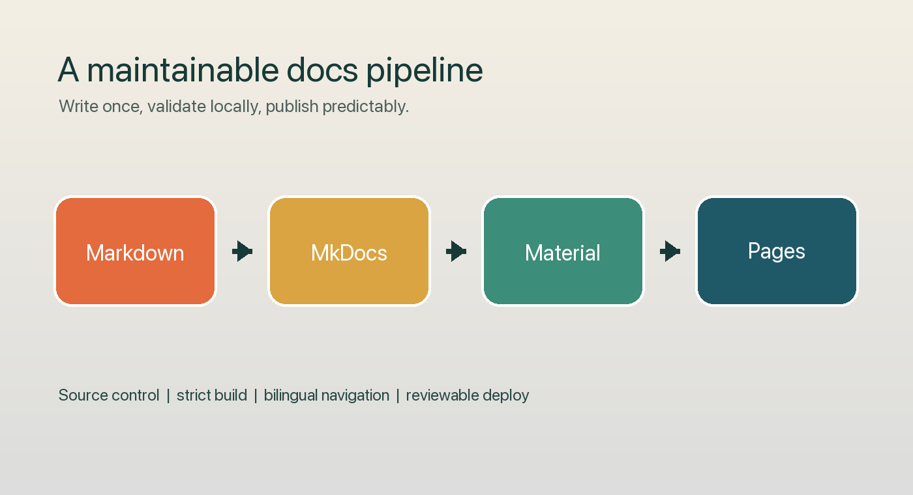

# 用 MkDocs 搭一个可维护的项目文档站

> ChatPost 调试标记：`CHATPOST-MKDOCS-SMOKE-V1`

写项目文档时，我们经常从一个 `README.md` 开始。随着安装方式、命令说明、设计约束和常见问题越来越多，README 很快就会变成一篇很难导航的长文。MkDocs 的价值，就是把这些 Markdown 文件组织成一个可以本地预览、严格构建并持续发布的文档站。



这篇文章用一个最小项目说明 MkDocs 的基本用法，也分享几个让文档长期可维护的实践。

## 为什么选择 MkDocs

MkDocs 的输入仍然是普通 Markdown，因此文档可以和代码一起进入 Git：

- 修改记录可以 Review；
- 文档与功能可以在同一个 PR 中更新；
- 本地构建能够提前发现坏链接和导航错误；
- 静态产物可以部署到 GitHub Pages、对象存储或任意 Web 服务器。

它并不试图替代内容本身。MkDocs 负责的是导航、主题、搜索和构建流程，而每一页仍然是便于阅读和维护的 Markdown。

## 建立最小项目

先创建一个隔离的 Python 环境，再安装 MkDocs 和 Material 主题：

```bash
python -m venv .venv
. .venv/bin/activate
python -m pip install "mkdocs>=1.6,<2.0" "mkdocs-material>=9.5,<10.0"
```

初始化站点：

```bash
mkdocs new docs-demo
cd docs-demo
```

目录结构很简单：

```text
docs-demo/
├── docs/
│   └── index.md
└── mkdocs.yml
```

`docs/` 存放源文件，`mkdocs.yml` 描述站点和导航。随着内容增加，可以按任务拆分页面，而不是把所有说明堆在首页。

## 配置导航和主题

下面是一份小而够用的配置：

```yaml
site_name: Demo Documentation

theme:
  name: material

nav:
  - 首页: index.md
  - 快速开始: quickstart.md
  - 命令参考: commands.md
```

导航最好围绕读者任务组织。例如“我要安装”“我要运行命令”“我要理解边界”，通常比按照开发时间线排列页面更容易使用。

| 页面 | 回答的问题 |
|---|---|
| 首页 | 这个项目解决什么问题？ |
| 快速开始 | 怎样完成第一次可用运行？ |
| 命令参考 | 有哪些真实可执行的命令？ |
| 能力地图 | 当前支持什么，暂不支持什么？ |

## 本地预览与严格构建

写作时可以启动开发服务器：

```bash
mkdocs serve
```

浏览器打开终端显示的本地地址后，Markdown 修改会自动刷新。提交前再执行严格构建：

```bash
mkdocs build --strict
```

严格模式很重要。它让缺失页面、错误导航和部分配置警告在 CI 中直接失败，而不是等网站上线后才由读者发现。

生成的静态文件位于 `site/`。这个目录通常应加入 `.gitignore`，因为它是可重复生成的构建产物，而不是文档源文件。

## 把文档纳入发布流程

一个稳定的文档流程可以分成三道门：

1. 本地执行测试和 `mkdocs build --strict`；
2. PR 创建临时预览，让 Review 同时覆盖内容与页面结构；
3. 合并到默认分支后部署正式站点，并对公开 URL 做 HTTP 回读。

仅仅看到 CI 绿灯还不够。部署任务成功、`gh-pages` 分支存在，也不一定意味着读者真的能访问页面。最终验收应该至少检查：首页返回 HTTP 200、关键页面存在、语言切换正常，以及仓库 About 中的文档地址与站点地址一致。

## 几个容易忽略的细节

### 文档只描述真实能力

如果某个命令还没有实现，应明确标为设计提案。不要把未来规划混进“当前命令树”，否则读者会把示例当成可以直接运行的接口。

### 中英文不要混写在同一页

双语站点更适合维护独立的中文和英文源文件，再由 i18n 插件生成语言入口。这样导航、搜索和正文语言都更清楚。

### 配置与秘密分开

站点名称、导航和公开 URL 可以进入仓库；部署 Token 等秘密只能由 CI Secret 或专门的凭据系统管理，不能写进 `mkdocs.yml`。

## 小结

MkDocs 的上手成本很低，但真正的价值来自流程：Markdown 是可 Review 的源文件，严格构建是合并门禁，静态部署负责交付，而线上回读完成最后验收。

如果项目一开始就把首页、快速开始、命令树和能力边界分开，后面添加新功能时，文档也更容易跟着代码一起演进。

参考资料：<https://www.mkdocs.org/>
